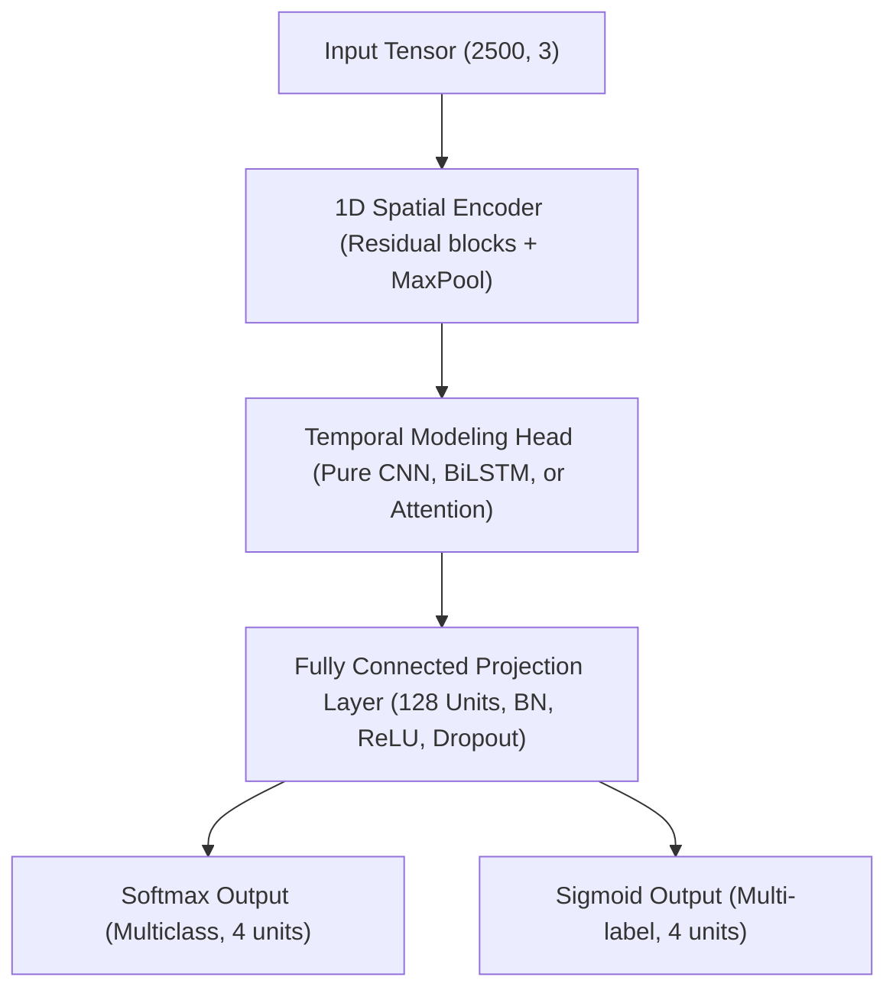

# 1D-CNN Arrhythmia Detection Architecture

This document describes the design and layers of the custom deep learning models implemented in `src/models/model_factory.py`. The network architecture is built to capture both localized spatial morphology (across ECG leads) and temporal sequence patterns (across time steps).

---

## 📐 Input Shape & Specifications
*   **Dimensions**: `(2500, 3)`
*   **Time Duration**: 10 seconds of signal.
*   **Channels**: 3 active channels corresponding to Lead I, Lead II, and Lead III.
*   **Sampling Rate**: Unified at 250 Hz (calibrated for real-time acquisition with the ADS1293 hardware sensor).

---

## 🧱 Architectural Components

### 1. Spatial Encoder Backbone (1D CNN)
The spatial encoder extracts localized waveform features (such as P-wave, QRS complex, and T-wave characteristics). It comprises multiple stacked **Residual Convolutional Blocks** interspersed with downsampling layers:

*   **Convolutions**: Uses standard 1D Convolutions (`Conv1D`) or Separable 1D Convolutions (`SeparableConv1D`) to adjust parameter weight complexity.
*   **Regularization**: Regularized with L2 weight decay (`3e-4`) to minimize overfitting.
*   **MaxPooling**: Downsamples the temporal resolution at early stages using `MaxPooling1D(pool_size=2, strides=2, padding='same')`.

### 2. Advanced Regularization & Attention Mechanisms
*   **Squeeze-and-Excitation (SE) Block**: An attention mechanism applied to the convolutional feature maps. It squeezes temporal maps (`GlobalAveragePooling1D`) into a channel description vector and excites it using a dense bottleneck path with a sigmoid scaling operator, highlighting critical leads.
*   **Stochastic Depth**: Applies a survival probability to residual paths. During training, residual branches are randomly dropped, forcing the network to learn robust features and allowing stable training of deeper architectures.
*   **Spatial Dropout**: Drops entire feature maps rather than individual elements, which is more effective for highly correlated 1D time-series signals.

### 3. Temporal Modeling Heads
The model supports three options for modeling sequence dependencies (configured via `Config.TEMPORAL_MODELS`):
*   **Pure CNN**: Standard Global Average Pooling directly after the CNN backbone.
*   **CNN + BiLSTM**: Passes the spatial features through a Bidirectional Long Short-Term Memory (`BiLSTM`) layer (64 units) to model sequence rhythms and transitions.
*   **CNN + Attention**: Applies a `MultiHeadAttention` block (4 heads, key dimension 32) to compute self-attention profiles across the temporal dimensions.

---

## 🎯 Classification Head & Output Schemes

The difference between the two experiment settings resides entirely in the classification head, adjusted dynamically using the `scheme` configuration:

### A. Multiclass Setting (Softmax Head)
Designed for single-label, mutually exclusive arrhythmia diagnostics.
*   **Output Layer**: `layers.Dense(4, activation='softmax', name="multiclass_output")`
*   **Classification Targets**: Classes are mapped using `LabelBinarizer` to a one-hot vector representation.
*   **Loss Function**: Stable Multi-class Focal Loss (balances minority classes like Atrial Fibrillation) or standard Categorical Crossentropy.
*   **Decision Rule**: Argmax (selects the category with the highest probability).

### B. Multi-label Setting (Sigmoid Head)
Designed for co-occurring cardiac arrhythmias (comorbidities), where a patient can exhibit multiple classes simultaneously (e.g., Atrial Fibrillation combined with Bradikardia).
*   **Output Layer**: `layers.Dense(4, activation='sigmoid', name="multilabel_output")`
*   **Classification Targets**: Multi-hot binary vectors.
*   **Loss Function**: Binary Crossentropy.
*   **Decision Rule**: Adaptive thresholding. Decision thresholds are tuned individually per-class on the validation set to optimize F1 scores, rather than assuming a default `0.5` boundary.
