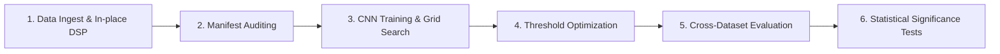

# End-to-End Experiment Pipeline

This document describes the workflow of the training and evaluation phases used to validate model modifications and research developments in this repository.

---

## 🏃 Pipeline Workflow Overview

The pipeline consists of six key phases, running from raw signal ingest to statistical validation:

---

## 📁 1. Data Ingest & Preprocessing
Raw files from the PTB-XL and Chapman datasets are preprocessed to the unified **250 Hz** target frequency. The output `.npy` signals and diagnostic target mappings are tracked via metadata CSV manifests:
*   **PTB-XL manifest**: Generated in `dataset/resample/manifest_ptbxl.csv`.
*   **Chapman manifest**: Generated in `dataset/resample/manifest_chapman.csv`.

### Training Resolutions Study
To evaluate the impact of source recording resolution on downstream model performance, the training pipeline isolates two distinct resampling paths:
1.  **500 Hz to 250 Hz path (Downsampled)**: Preserves maximum high-frequency features. Signals are cleaned at 500 Hz, downsampled to 250 Hz, and standardized.
2.  **100 Hz to 250 Hz path (Upsampled)**: Cleaned at 100 Hz, then upsampled to 250 Hz. This represents hardware configurations that operate at lower power/frequency baselines.

---

## 🔍 2. Manifest & Preprocessing Audits
Before training, files are run through quantitative and visual exploratory data analysis (EDA) to ensure signal integrity:
*   **EDA Analysis**: `src/analysis/eda_visualization.py` plots class balances and age/gender demographic breakdowns (both datasets combined).
*   **Preprocessing Quality Audit**: `src/analysis/eda_quantitative_audit.py` evaluates the denoising filters by calculating Pseudo-SNR, spectral entropy shifts, HRV (RR/RMSSD), Pearson/DTW morphology preservation, and baseline-wander reduction.

---

## 🏋️ 3. CNN Model Training & Grid Search
All training runs are executed through the unified runner `src/experiments/run_experiment.py`. The active configuration is declared in `src/config/experiment_configs.py`:

| Config field | Values | Meaning |
|---|---|---|
| `SCHEME` | `"softmax"` \| `"sigmoid"` | Multiclass head vs. multi-label head |
| `LABEL_SCHEME` | `"mapped"` \| `"native"` | Shared 4-class labels vs. each dataset's own diagnostic codes |
| `TRAIN_DATASET` | `"PTBXL"` \| `"CHAPMAN"` | Training split source |
| `TEST_DATASET` | `"PTBXL"` \| `"CHAPMAN"` | Test/eval split source (supports cross-dataset) |

Dataset splits are centralized in `src/training/dataset_loader.py`:

-   **PTB-XL**: uses the official `strat_fold` splits — folds 1-8 train, fold 9 validation, fold 10 test. Native labels resolve from the max-confidence SCP code in `scp_codes`.
-   **Chapman**: no official folds, so a stratified random 70/15/15 split is used (seed 42), dropping classes with fewer than `min_count` samples when `LABEL_SCHEME="native"`. Native labels resolve from each record's diagnostic string.

> Cross-dataset training (e.g. `TRAIN_DATASET="PTBXL"`, `TEST_DATASET="CHAPMAN"`) requires `LABEL_SCHEME="mapped"` because the two datasets have incompatible native diagnostic vocabularies.

*   **Grid Search Parameters**: Fits combinations of filter depths (Small vs. Medium), kernel spaces (Balanced, Hybrid Morphology, Huge Receptive), dilations, and temporal models (Pure CNN, CNN-BiLSTM, CNN-Attention, Pure LSTM) as configured in `experiment_configs.py`.
*   **Augmentation Options**: Features on-the-fly Mixup regularization and random physiological noise injection (baseline wander, Gaussian noise, gain scaling). Class balancing (undersampling/oversampling) applies to the mapped scheme only.

---

## 🎯 4. Post-Training Tuning & Test Set Isolation
*   **Multi-label Threshold Tuning**: In multi-label setups, predicting class probabilities via Sigmoid activation does not assume a uniform `0.5` threshold. Instead, the model outputs for the validation set (PTB-XL fold 9, or the Chapman validation split) are scanned across threshold intervals `[0.1, 0.9]` to assign optimal decision boundaries per-class that maximize class-specific F1 scores. Tuning runs on validation only to avoid test-set leakage.
*   **Independent Test Evaluation**: The tuned models and thresholds are evaluated against the held-out test split to obtain clean, unbiased performance metrics, recorded in `output/research_experiments/master_experiment_tracker.csv`.
*   **Cross-Dataset Validation**: `src/evaluation/cross_dataset_test.py` evaluates registry models bidirectionally — PTB-XL trained against Chapman's domain and vice versa (plus optional per-dataset sanity runs via `--per-dataset`). Legacy models keep their original class ordering via per-folder `class_names.json` annotations.

---

## 📈 5. Evaluation, Visualizations & Statistical Significance
All results are compiled and saved to the experiment's directory:
*   **Exported Artifacts**: Generates training history CSV curves, a classification report, model architecture summaries, and confusion matrices.
*   **Error Logging**: Generates medical-grade stacked lead plots showing misclassified waveforms with confidence estimates.
*   **Explainability**: Grad-CAM overlays identify the precise time regions influencing predictions.
*   **Statistical Tests**: `src/evaluation/run_statistical_tests.py` reads the unified master tracker and runs Wilcoxon signed-rank tests comparing pairwise F1 scores between runs (pairs auto-derived from runs sharing a base experiment and differing only in architecture suffix), plus 95% confidence intervals per experiment.
