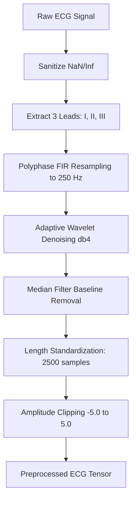

# ECG Preprocessing Pipeline Specification

To achieve research-grade accuracy and ensure compatibility with real-time acquisition hardware, this repository implements a comprehensive Digital Signal Processing (DSP) pipeline that standardizes all ECG inputs before feeding them to the deep learning model.

---

## 📐 Unified 250 Hz Sampling & Sensor Alignment

In clinical settings, ECG datasets are recorded at varying sampling frequencies (e.g., PTB-XL has native subsets at 100 Hz and 500 Hz; Chapman is recorded at 500 Hz). 

This pipeline standardizes all inputs to a unified frequency of **250 Hz**. 

### Hardware Alignment (ADS1293 Sensor)
The selection of 250 Hz is intentionally aligned with the physical analog front-end (AFE) of our hardware platform: the **ADS1293 3-channel ECG sensor**.
*   **Sensor Configuration**: The ADS1293 is set to record 3 leads at **250 Hz**.
*   **Zero Calibration Delay**: Processing signals at 250 Hz in research avoids any sampling rate conversion overhead when deploying the trained models to real-time hardware microcontrollers.

---

## 🛠️ Step-by-Step DSP Pipeline

The preprocessing logic is implemented in `src/preprocessing/preprocessing.py`. Every input signal undergoes the following sequential transformations:

### 1. Sanitization & Lead Extraction
*   **Sanitization**: Cleans arrays by replacing any corrupted NaN, `+Inf`, or `-Inf` values with `0.0`.
*   **Channel Selection**: Selects 3 specific channels representing **Lead I**, **Lead II**, and **Lead III** (corresponding to indices `[0, 1, 2]` from the database) as configured in `src/config/config.py`.

### 2. Polyphase FIR Resampling
Instead of simple linear interpolation or FFT-based resampling (which introduce ripple artifacts near steep QRS peaks), the pipeline uses **Polyphase FIR Filter Resampling** (`scipy.signal.resample_poly`):
*   **100 Hz Native**: Upsampled to 250 Hz (ratio 5:2).
*   **500 Hz Native**: Downsampled to 250 Hz (ratio 1:2).

### 3. Wavelet Denoising
Suppress high-frequency muscle noise (EMG) and power line interference without flattening the vital QRS complex:
*   **Wavelet Type**: Daubechies 4 (`db4`), which mirrors the typical morphology of healthy ECG complexes.
*   **Decomposition Level**: 4 levels.
*   **Thresholding**: Soft-thresholding applied to detail coefficients based on the noise standard deviation estimation.

### 4. Baseline Wander Removal
Removes low-frequency baseline drifts (caused by patient breathing or sensor movements):
*   Uses a cascade of median filters (`scipy.signal.medfilt`) to estimate the baseline drift, which is then subtracted from the clean signal.

### 5. Length Standardization & Clipping
*   **Target Length**: Unified to exactly **2500 samples** (representing a 10-second window at 250 Hz) as defined by `TARGET_LEN[250]` in `config.py`.
    *   *Shorter signals*: Padded with zeros.
    *   *Longer signals*: Center-cropped.
*   **Amplitude Standardization**: Signal amplitudes are clipped between `[-5.0, 5.0]` millivolts to protect the network from extreme outlier spikes.
