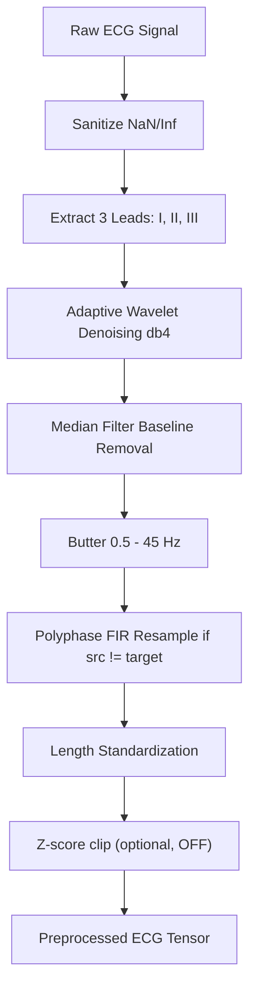

# ECG Preprocessing Pipeline Specification

To achieve research-grade accuracy and ensure compatibility with real-time acquisition hardware, this repository implements a comprehensive Digital Signal Processing (DSP) pipeline that standardizes all ECG inputs before feeding them to the deep learning model.

---

## 📐 Active Sampling Schemes (100 Hz / 500 Hz)

In clinical settings, ECG datasets are recorded at varying sampling frequencies (PTB-XL has native
subsets at 100 Hz and 500 Hz; Chapman is recorded at 500 Hz). Instead of a single unified target,
the pipeline keeps the **two native resolutions** and exposes them as selectable folders:

| Folder (resample/)          | Content                              | fs    | target_len |
|-----------------------------|--------------------------------------|-------|-----------|
| `ptbxl_raw_100hz`           | PTB-XL native 100 Hz (unprocessed)   | 100   | 1000      |
| `ptbxl_clean_100hz`         | PTB-XL 100 Hz cleaned                | 100   | 1000      |
| `ptbxl_raw_500hz`           | PTB-XL native 500 Hz (unprocessed)   | 500   | 5000      |
| `ptbxl_clean_500hz`         | PTB-XL 500 Hz cleaned                | 500   | 5000      |
| `chapman_raw_100hz`         | Chapman downsampled to 100 Hz (raw)  | 100   | 1000      |
| `chapman_clean_100hz`       | Chapman 100 Hz cleaned               | 100   | 1000      |
| `chapman_raw_500hz`         | Chapman native 500 Hz (unprocessed)  | 500   | 5000      |
| `chapman_clean_500hz`       | Chapman 500 Hz cleaned               | 500   | 5000      |

* **Raw ("murni") folders** hold unprocessed tensors (only sanitization + length standardization).
* **Cleaned folders** hold the full `CLEANING_FLAGS`-driven pipeline below.
* The single active folder per dataset is `Config.FOLDER_PTBXL` / `Config.FOLDER_CHAPMAN`
  (`src/config/experiment_configs.py`); the training runner derives `INPUT_SHAPE` from it.

> **Hardware alignment (ADS1293 AFE)**: the unified **250 Hz** scheme (100 Hz → upsampled 250 Hz and
> 500 Hz → downsampled 250 Hz, calibrated to the ADS1293 3-lead sensor) is **deferred to a future
> experiment**. The legacy 250 Hz folders and config keys are retained in `config.SUB_FOLDERS` but are
> no longer generated by default (`GENERATE_SCHEMES["250hz"] = False`). Set it to `True` in
> `proccess_ptbxl.py` / `proccess_chapman.py` to regenerate the 250 Hz folders.

> **Portable manifests**: the `path_*` columns in `manifest_ptbxl.csv` / `manifest_chapman.csv` store
> paths **relative to the project root** (`config.BASE_DIR`), so the `dataset/resample` folder can be
> uploaded to Kaggle and mounted elsewhere without rewriting the CSV. Use `config.resolve_path()` to
> turn them back into absolute paths (EDA does this automatically).

---

## 🎛️ Config-Driven Cleaning Flags

Every DSP stage can be toggled independently in `src/preprocessing/preprocessing.py`:

| Flag                    | Current value | Stage                                                        |
|-------------------------|---------------|--------------------------------------------------------------|
| `apply_wavelet_denoising` | `True`       | Adaptive wavelet `db4` denoising (baseline wander / HF noise) |
| `apply_median_baseline` | `True`         | Median-filter baseline removal                              |
| `apply_butter_bandpass` | `True`         | High-frequency filter, existing bounds: 0.5–45 Hz (or 0.5–100 Hz when fs ≥ 250) |
| `apply_zscore_clip`     | `False`        | z-score normalization + amplitude clipping (±5.0) — **disabled** (code kept) |

Today the schedule is **`wavelet_denoising + median_baseline + butter_bandpass`** (verified by
`cleaning_pipeline_description()`). Experiments therefore compare **raw ("murni")** folders vs.
**cleaned** folders to isolate the effect of the light cleaning above.

---

## 🛠️ Step-by-Step DSP Pipeline

The preprocessing logic is implemented in `src/preprocessing/preprocessing.py`. Every **cleaned** input
undergoes the following sequential transformations (stages gated by `CLEANING_FLAGS`):

```mermaid
graph TD
    A[Raw ECG Signal] --> B[Sanitize NaN/Inf]
    B --> C[Extract 3 Leads: I, II, III]
    C --> D[Adaptive Wavelet Denoising db4]
    D --> E[Median Filter Baseline Removal]
    E --> F[Butter 0.5 - 45 Hz]
    F --> G[Polyphase FIR Resample if src != target]
    G --> H[Length Standardization]
    H --> I["Z-score clip (optional, OFF)"]
    I --> J[Preprocessed ECG Tensor]
```

### 1. Sanitization & Lead Extraction
*   **Sanitization**: Cleans arrays by replacing any corrupted NaN, `+Inf`, or `-Inf` values with `0.0`.
*   **Channel Selection**: Selects 3 specific channels representing **Lead I**, **Lead II**, and **Lead III**
    (corresponding to indices `[0, 1, 2]` from the database) as configured in `src/config/config.py`.

### 2. Wavelet Denoising
Suppress high-frequency muscle noise (EMG) and power line interference without flattening the vital QRS complex:
*   **Wavelet Type**: Daubechies 4 (`db4`), which mirrors the typical morphology of healthy ECG complexes.
*   **Decomposition Level**: 4 levels.
*   **Thresholding**: Soft-thresholding applied to detail coefficients based on the noise standard deviation estimation.

### 3. Baseline Wander Removal
Removes low-frequency baseline drifts (caused by patient breathing or sensor movements):
*   Uses a cascade of median filters (`scipy.signal.medfilt`) to estimate the baseline drift, which is then
    subtracted from the clean signal (kernel `101` for fs ≥ 500, else `51`).

### 4. Bandpass Filter (High-Frequency Filter)
Band-limits the signal using the **existing bounds**: `scipy.signal.butter(4)` with `lowcut = 0.5 Hz` and
`highcut = 100.0 Hz` when `src_fs >= 250`, otherwise `highcut = 45.0 Hz`.

### 5. Polyphase FIR Resampling
Instead of simple linear interpolation or FFT-based resampling (which introduce ripple artifacts near steep
QRS peaks), the pipeline uses **Polyphase FIR Filter Resampling** (`scipy.signal.resample_poly`), applied
only when `src_fs != target_fs` (e.g., Chapman 500 Hz → 100 Hz path).

### 6. Length Standardization
*   **Target Length**: `target_len = TARGET_LEN[fs]` in `config.py` — **1000 samples** at 100 Hz, **5000 samples**
    at 500 Hz (10-second window).
    *   *Shorter signals*: Padded with zeros.
    *   *Longer signals*: Center-cropped.

### 7. Amplitude Standardization (currently OFF)
Raw/cleaned folders skip amplitude normalization. When `apply_zscore_clip = True` the final z-score
normalization clips amplitudes between `[-5.0, 5.0]` to protect the network from extreme outlier spikes.