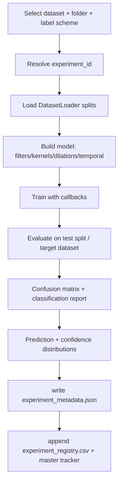

# Research Progress & Reproducibility

This document is the single source of truth for the arrhythmia-detection
research roadmap: phases, experiment IDs, the experiment record schema, and
the reproducibility contract every run must satisfy.

## Table of Contents

- [1. Research Phases](#1-research-phases)
- [2. Experiment IDs](#2-experiment-ids)
- [3. Experiment Record Schema](#3-experiment-record-schema)
- [4. Reproducibility Metadata](#4-reproducibility-metadata)
- [5. Experiment Flow](#5-experiment-flow)
- [6. Versioning & Release Policy](#6-versioning--release-policy)

## 1. Research Phases

| Phase | Focus | Status | Experiment IDs |
|---|---|---|---|
| 0 | Repository & pipeline infrastructure | In progress (infra items below) | — |
| 1 | Raw-data baselines (PTB-XL, Chapman, per fs) | Planned | `RAW_*_3L` |
| 2 | Cleaned-data comparison vs raw | Planned | `CLEAN_*_3L` |
| 3 | Cross-dataset (zero-shot external) | Planned | `CROSS_*_TO_*` |
| 4 | Clinical 3-lead analysis (I, II, III) | Planned | `*_3L` |
| 5 | Focused model for the best lead/fs combo | Planned | `FOCUSED_*_3L` |
| 6 | Derived-lead experiments | Planned | `DERIVED_*_3L` |
| 7 | Rule-based baseline vs deep model | Planned | `RULE_*_3L` |

Infrastructure items in Phase 0:

- [x] 100/500 Hz raw + cleaned folder scheme
- [x] Self-contained manifests (`native_label` column, `LABEL_SCHEME="native"`)
- [x] GPU auto-detection + cross-platform (Windows/Linux) training
- [x] Experiment ID + metadata + registry infrastructure
- [x] Prediction / confidence distribution artifacts
- [ ] Dataset profile EDA (`output/eda_dataset_profiles/`)
- [ ] Threshold tuning (kept, gated off) — multi-label sigmoid track

## 2. Experiment IDs

Every experiment record carries one `experiment_id`. IDs follow the spec:

| Pattern | Meaning |
|---|---|
| `RAW_PTBXL_3L` | Raw PTB-XL, 3 leads (I, II, III) |
| `RAW_CHAPMAN_3L` | Raw Chapman, 3 leads |
| `CLEAN_PTBXL_3L` | Cleaned PTB-XL, 3 leads |
| `CLEAN_CHAPMAN_3L` | Cleaned Chapman, 3 leads |
| `CROSS_PTBXL_TO_CHAPMAN` | Trained PTB-XL, tested Chapman (mapped scheme) |
| `CROSS_CHAPMAN_TO_PTBXL` | Trained Chapman, tested PTB-XL (mapped scheme) |
| `FOCUSED_*_3L` | Phase 5 focused models |
| `DERIVED_*_3L` | Phase 6 derived leads |
| `RULE_*_3L` | Phase 7 rule-based baseline |

Behavior in `run_experiment.py`:

- `Config.EXPERIMENT_ID` set explicitly → used verbatim.
- Otherwise inferred from `TRAIN_DATASET / TEST_DATASET` and the active folder.

### `experiment_id` vs run folder name

- `experiment_id` is the *research-phase* ID (stable for a whole phase run, e.g. grid variants share it).
- The run folder name (`experiment_name`, e.g. `softmax_native_ptbxl_clean_500hz__Medium__Balanced__Progressive_Dilation__Pure_CNN`) is the *unique* identifier of one training run.
- The registry CSV records both, so one `experiment_id` maps to all grid variants of that phase.

## 3. Experiment Record Schema

Each run writes `experiment_metadata.json` (nested) inside its run folder and
one flattened row into `output/experiments/experiment_registry.csv`.

| # | Field | Notes |
|---|---|---|
| 1 | `experiment_id` | phase-level ID (see §2) |
| 2 | `dataset_train` | `PTBXL` / `CHAPMAN` |
| 3 | `dataset_test` | `PTBXL` / `CHAPMAN` |
| 4 | `dataset_version` | folder key + sampling rate + signal length |
| 5 | `preprocessing_version` | `PIPELINE_VERSION` + cleaning description |
| 6 | `lead_configuration` | lead names + indices (`I,II,III`) |
| 7 | `label_configuration` | scheme + class names + count |
| 8 | `model_version` | e.g. `cnn_v1` |
| 9 | `random_seed` | default `42` |
| 10 | `training_configuration` | batch/epochs/lr/loss/class-weight/mixup/… |
| 11 | `checkpoint` | `best_model.keras` path |
| 12 | `metrics` | `metrics.csv` path + headline summaries |
| 13 | `confusion_matrix` | PNG path |
| 14 | `prediction_distribution` | per-class true/pred counts CSV |
| 15 | `confidence_distribution` | per-class probability stats CSV |
| 16 | `notes` | free text (`Config.EXPERIMENT_NOTE`) |
| 17 | `interpretation` | free text (`Config.EXPERIMENT_INTERPRETATION`) |
| 18 | `status` | `completed` / `failed` / `running` |

The environment block (OS / Python / TF / GPU / CUDA) is appended to every
JSON record and mirrored into the registry row for comparability.

## 4. Reproducibility Metadata

Every `experiment_metadata.json` captures:

- **Environment**: OS + release, Python, TensorFlow, CUDA/cuDNN (build info),
  GPU device names + compute capability, CPU count.
- **Experiment**: all 18 schema fields above.
- **Data**: folder key, fs, signal length, class names, lead set, pipeline version.
- **Model**: architecture config (filters / kernels / dilations / temporal mode).
- **Training**: seed, batch size, LR, epochs, loss, augmentation, mixup,
  class weighting, threshold-tuning state.

GPU reproduction contract:

- Seed fixed via `set_global_seeds()` (numpy / random / TF, incl. op-level seed).
- `Config.THRESHOLD_TUNING` default `False` (single flat 0.5 threshold on the
  sigmoid track); the tuning code path is preserved for later re-enabling.
- Windows native and Linux-GPU runs are recorded with the same 18-field schema,
  so a registry comparison directly shows environment-level differences.

## 5. Experiment Flow

## 6. Versioning & Release Policy

- `CHANGELOG.md` follows Keep a Changelog; versions bump on merged feature work.
- Preprocessing pipeline changes bump `PIPELINE_VERSION` (breaking → new folder
  scheme; additive → patch) and invalidate prior experiment records for
  pre/post comparison — records always pin the pipeline version that produced them.
- Results are only comparable across runs with the same
  `dataset_version` + `preprocessing_version` + `lead_configuration`.